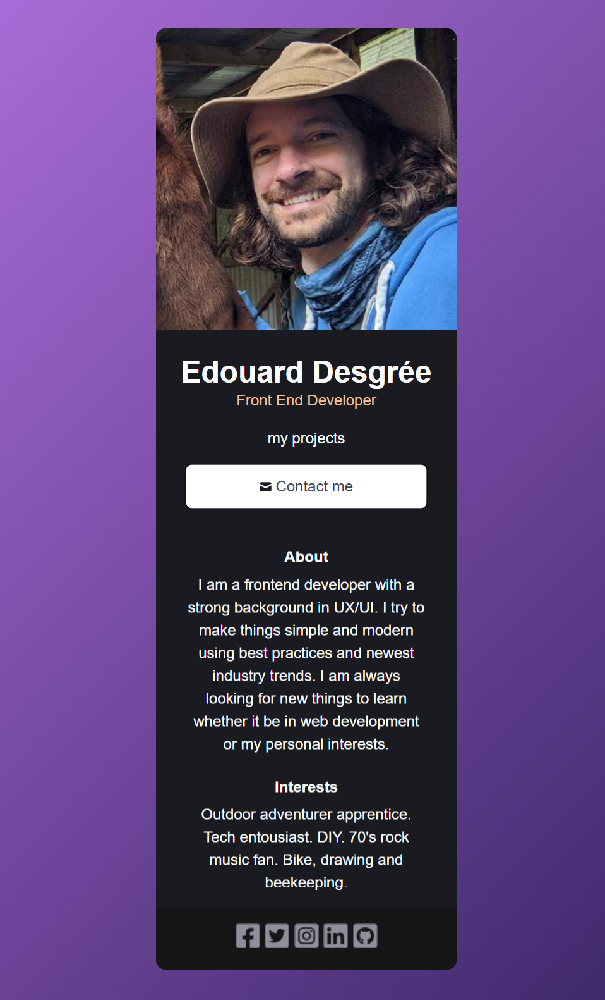

# react business card

The project is to a one page business card React app.
It is bootstraped with Vite.js.

🔗 **Live preview:** [here](https://jovial-fudge-a4bda2.netlify.app/)

### Screenshot

## Built with

### Technologies

- HTML
- CSS
- React JS

### Tools

- Vite

## Features

- One page app with static content

## What I learned

- Better knowledge of **React** use of components and assets imports.

## Author

👤 **Edouard Desgrée**

- GitHub: [edesgree](https://github.com/edesgree)

#### Created while working on the [The Odin Project](https://www.theodinproject.com/) and a [scrimba](https://scrimba.com/) class
